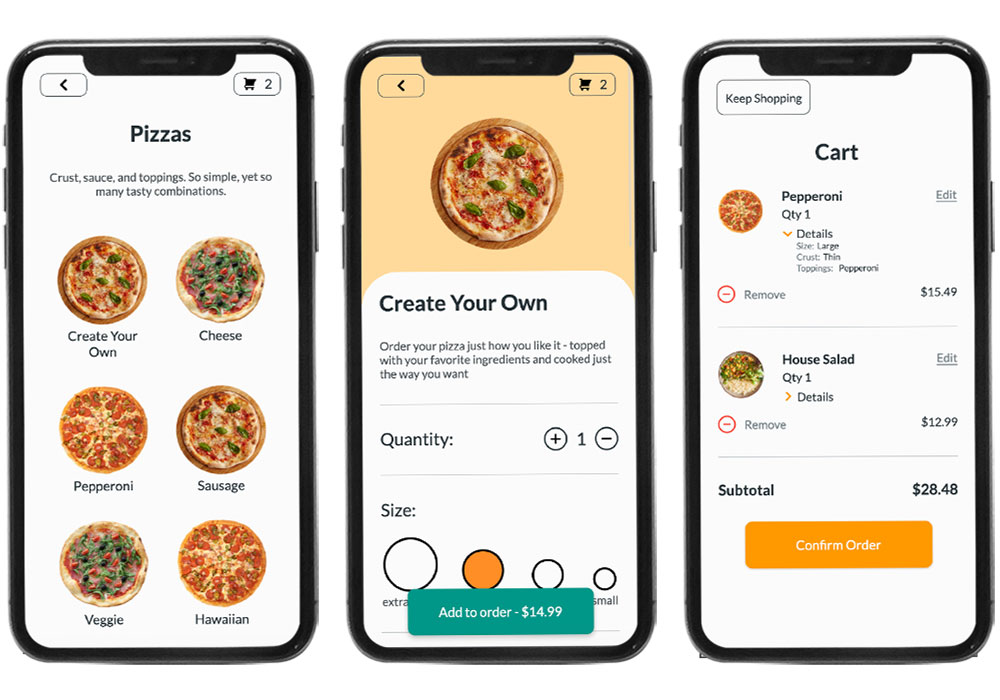

# PizzaOrder

An online ordering platform for a mock pizza restaurant, where users have complete control over their order

## Table of contents

- [Overview](#overview)
  - [The challenge](#the-challenge)
  - [Screenshot](#screenshot)
  - [Links](#links)
- [My process](#my-process)
  - [Built with](#built-with)
  - [What I learned](#what-i-learned)
  - [Continued development](#continued-development)
  <!-- - [Useful resources](#useful-resources) -->
- [Author](#author)
<!-- - [Acknowledgments](#acknowledgments) -->

## Overview

### The challenge

Users should be able to:

- Select any item on the menu, edit it, and add it to their order
- If the selected item is a pizza, have editing control over size, crust, sauce, cheese, and an assortment of toppings which can even be split to different sides of the pizza for sharing wih friends
- See a confirmation screen, telling them what they've just added to their cart
- View all of the items in the cart and a subtotal price
- Have the option to delete an item or edit it, both of which will update the cart

### Screenshots



### Links

- Live Site URL: [https://pizza-order.netlify.app/](https://pizza-order.netlify.app/)

## My process

### Built with

- Mobile-first workflow
- Semantic HTML5 markup
- CSS Flex and Grid
- SASS (SCSS)
- [React](https://reactjs.org/) - JS library

### What I learned

#### Showing a loading screen while images are loading

In every component that displays images I had to...

Write a function that would scan a parent element for images and return whether or not they have been completed
```js
function imagesLoaded(parentNode) {
    const imgElements = parentNode.querySelectorAll("img");
    for (const img of imgElements) {
        if (!img.complete) {
            return false;
        }
    }
    return true;
}
```

Write a handler function that would set state to loading: false if the images have not loaded
```js
handleStateChange = () => {
    this.setState({
        loading: !imagesLoaded(this.listElement),
    })
}
```

Set a ref value on the image parent so it can be referenced by imagesLoaded, call handleStateChange on onLoad for each image, and conditionally render the loader and the image parent
```js
renderLoadingScreen = () => {
    if (!this.state.loading) {
        return null;
    }
    return (
        <LoadingScreen />
    )
}

render() {
    const itemList = this.props.category.items.map(item => {
        return (
            <li
                className=""
                key={item.id}
                onClick={() => (
                    this.handleClick(item)
                )}
            >
                
                <h3>{item.name}</h3>
            </li>
        )
    });

    return (
        <div className="MenuItemList">
            <h2>{this.props.category.category}</h2>
            <p>{this.props.category.description}</p>
            {this.renderLoadingScreen()}
            <ul className={this.state.loading ? 'hide' : ''} ref={element => { this.listElement = element }}>
                {itemList}
            </ul>
        </div>
    );
}
```
### Continued development

Ways to improve this app include
- Moving ingredientsData, menuData, and all images off of the app frontend
- Adding user login, for viewing past orders and saving favorites
- Refactoring with Redux for better state management

<!-- ### Useful resources

- [Example resource 1](https://www.example.com) - This helped me for XYZ reason. I really liked this pattern and will use it going forward.
- [Example resource 2](https://www.example.com) - This is an amazing article which helped me finally understand XYZ. I'd recommend it to anyone still learning this concept.

**Note: Delete this note and replace the list above with resources that helped you during the challenge. These could come in handy for anyone viewing your solution or for yourself when you look back on this project in the future.** -->

## Author

- [Michael Weber](https://michaelweber.dev/)
- [LinkedIn](https://www.linkedin.com/in/michaelscottweber/)

<!-- ## Acknowledgments

This is where you can give a hat tip to anyone who helped you out on this project. Perhaps you worked in a team or got some inspiration from someone else's solution. This is the perfect place to give them some credit.

**Note: Delete this note and edit this section's content as necessary. If you completed this challenge by yourself, feel free to delete this section entirely.** -->
